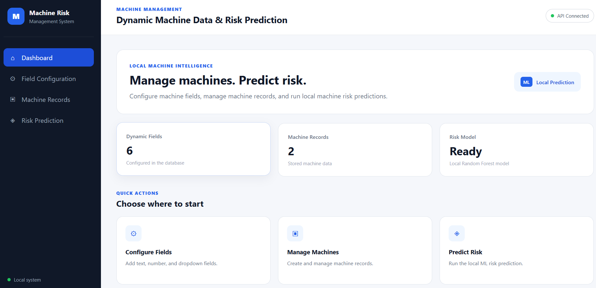
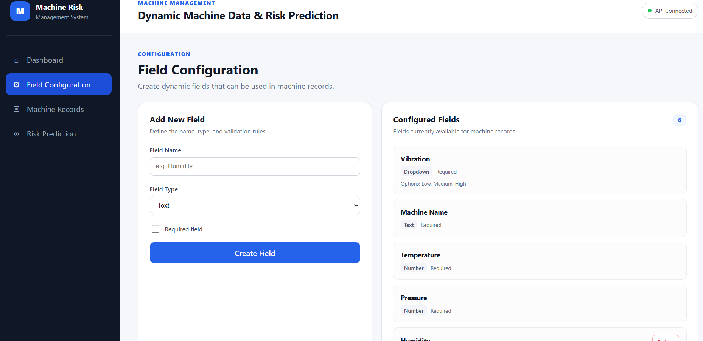
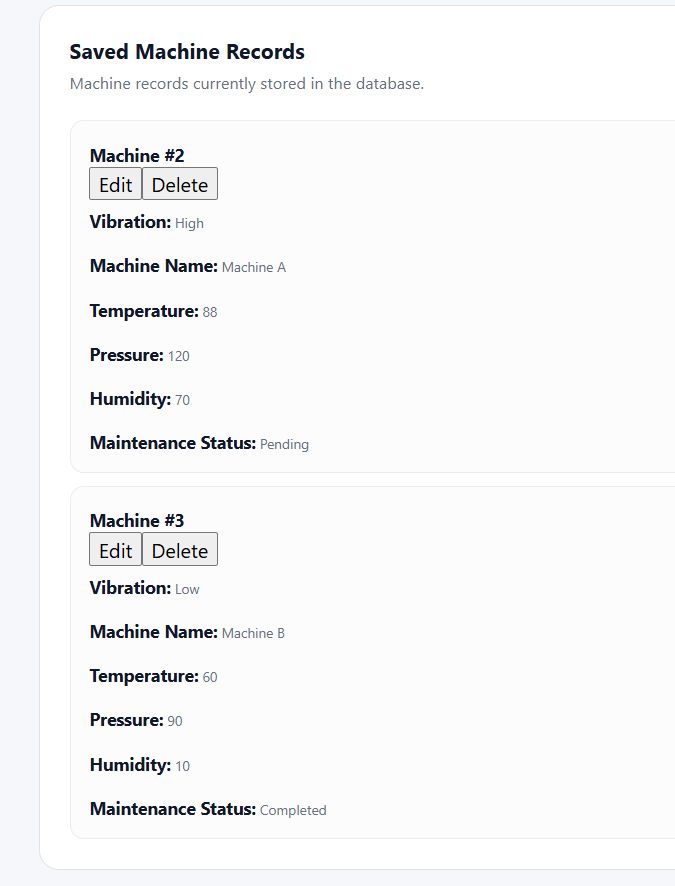
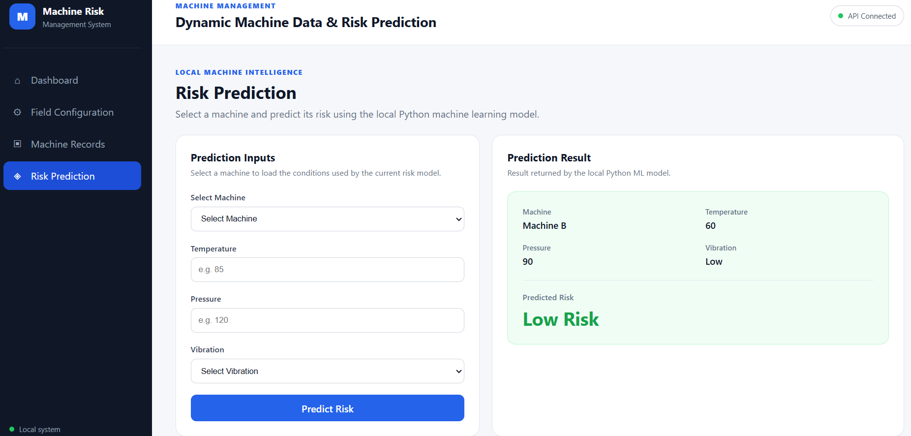

# NTT DATA Machine Risk Prediction

### Dynamic Machine Data Management & Local Risk Prediction

A full-stack web application for dynamically managing machine data and predicting machine risk using a locally executed Python Machine Learning model.

## Application Preview

### Dashboard



The dashboard provides an overview of the configured fields, machine records, and the readiness status of the local risk prediction model.

### Field Configuration



Dynamic fields can be created using Text, Number, and Dropdown types, with support for required fields and dropdown options.

### Machine Records



Machine records are created and managed using the dynamically configured fields.

### Risk Prediction



The application uses the local Python Machine Learning model to classify machine risk as Low Risk, Medium Risk, or High Risk.

## Project Overview

This application provides a web-based solution for dynamically managing machine data and performing local machine risk prediction.

The system allows users to configure machine fields such as Text, Number, and Dropdown fields, define required or optional fields, and specify options for Dropdown fields.

Configured fields are used to create and manage machine records through a dynamic data-entry form. Machine data is stored in a SQLite database using a flexible field/value structure, allowing new fields such as Humidity to be added without requiring a database schema change for each new machine attribute.

For risk prediction, the current Machine Learning model uses Temperature, Pressure, and Vibration as input features and classifies the machine into Low Risk, Medium Risk, or High Risk.

The frontend is built with React, the backend is implemented using FastAPI, and the Machine Learning model runs locally using Python and scikit-learn.

## Key Features

### Dynamic Field Configuration

- Create machine fields dynamically without changing the database schema.
- Support Text, Number, and Dropdown field types.
- Configure fields as required or optional.
- Define custom options for Dropdown fields.
- Add new fields such as Humidity through the application.
- Prevent deletion of protected core fields.
- Prevent deletion of custom fields that are already used by machine records.

### Machine Record Management

- Create machine records using dynamically configured fields.
- View existing machine records.
- Edit machine records.
- Delete machine records.
- Validate required, numeric, and dropdown field values.
- Store dynamic field values without requiring database schema changes.

### Local Machine Risk Prediction

- Predict machine risk using a locally executed Python Machine Learning model.
- Use Temperature, Pressure, and Vibration as the current prediction features.
- Classify machine risk as Low Risk, Medium Risk, or High Risk.
- Display the prediction result in the web interface.

### Dashboard

- View the number of configured machine fields.
- View the number of machine records.
- View the readiness status of the local risk prediction model.
- Navigate to the main application modules.

## System Architecture

The application follows a simple full-stack architecture where the React frontend communicates with the FastAPI backend through REST APIs. The backend manages database operations and invokes the local Python Machine Learning component for risk prediction.

```text
                    ┌─────────────────────────┐
                    │      React Frontend     │
                    │                         │
                    │  • Dashboard            │
                    │  • Field Configuration  │
                    │  • Machine Records      │
                    │  • Risk Prediction      │
                    └────────────┬────────────┘
                                 │
                            REST / JSON
                                 │
                                 ▼
                    ┌─────────────────────────┐
                    │     FastAPI Backend     │
                    │                         │
                    │  • API Endpoints        │
                    │  • Request Validation   │
                    │  • CRUD Operations      │
                    │  • ML Integration       │
                    └──────────┬──────┬───────┘
                               │      │
                         Database     │ Local Process
                               │      │
                               ▼      ▼
                    ┌──────────────┐  ┌────────────────────┐
                    │    SQLite    │  │  Python ML         │
                    │   Database   │  │    Component       │
                    │              │  │                    │
                    │ • Fields    │  │ • predict.py       │
                    │ • Machines  │  │ • predict_cli.py   │
                    │ • Values    │  │ • Random Forest    │
                    └──────────────┘  └──────────┬─────────┘
                                                │
                                                ▼
                                      ┌──────────────────┐
                                      │   Risk Result    │
                                      │                  │
                                      │ Low / Medium /  │
                                      │ High Risk        │
                                      └──────────────────┘
```

## Data Flow

### 1. Dynamic Field Configuration

```text
User
  │
  ▼
React Field Configuration
  │
  ▼
FastAPI API
  │
  ▼
SQLite Database
  │
  ▼
Field Configuration Stored
```

Users can create fields such as Text, Number, and Dropdown through the frontend. The backend validates the configuration and stores it in the database.

### 2. Machine Record Flow

```text
User
  │
  ▼
Dynamic Machine Form
  │
  ▼
FastAPI Validation
  │
  ▼
SQLite Database
  │
  ▼
Machine Record + Dynamic Values
```

The machine form is generated using the configured fields. Required fields, numeric values, and Dropdown options are validated before the record is stored.

### 3. Risk Prediction Flow

```text
User Selects Machine
        │
        ▼
Temperature + Pressure + Vibration
        │
        ▼
React Frontend
        │
        ▼
FastAPI Prediction Endpoint
        │
        ▼
Local Python ML Component
        │
        ▼
Random Forest Model
        │
        ▼
Low / Medium / High Risk
        │
        ▼
React Frontend
```

For example, a machine with:

```text
Temperature: 85
Pressure:    120
Vibration:   High
```

is passed to the local Machine Learning model, which returns the corresponding risk classification.

### 4. Dynamic Field Extension

A new field such as **Humidity** can be added through the Field Configuration module without modifying the database schema.

The newly created field becomes available when creating or editing machine records. The current risk prediction model continues to use Temperature, Pressure, and Vibration as its prediction features.

## Technology Stack

| Layer | Technology | Purpose |
|---|---|---|
| Frontend | React + Vite | User interface and application modules |
| Backend | FastAPI | REST APIs, validation, CRUD operations, and ML integration |
| Database | SQLite | Stores field configurations, machine records, and dynamic values |
| ORM | SQLAlchemy | Database models and database operations |
| Machine Learning | Python + scikit-learn | Local machine risk prediction |
| ML Algorithm | Random Forest Classifier | Classifies machine risk into Low, Medium, or High Risk |
| Data Processing | Pandas | Prepares input data for the ML model |
| Model Persistence | Joblib | Saves and loads the trained ML model |
| API Communication | REST / JSON | Communication between frontend and backend |
| Development | VS Code, Git, GitHub | Development and version control |

## Project Structure

```text
nttdata-machine-risk-prediction/
│
├── backend/
│   ├── app/
│   │   ├── routes/
│   │   │   ├── fields.py
│   │   │   └── machines.py
│   │   │
│   │   ├── database.py
│   │   ├── main.py
│   │   ├── models.py
│   │   ├── schemas.py
│   │   └── seed.py
│   │
│   ├── machine_risk.db
│   └── requirements.txt
│
├── frontend/
│   ├── public/
│   │   ├── favicon.svg
│   │   └── icons.svg
│   │
│   ├── src/
│   │   ├── components/
│   │   │   ├── FieldConfiguration.jsx
│   │   │   ├── MachineRecords.jsx
│   │   │   └── RiskPrediction.jsx
│   │   │
│   │   ├── services/
│   │   │   └── api.js
│   │   │
│   │   ├── App.css
│   │   ├── App.jsx
│   │   ├── index.css
│   │   └── main.jsx
│   │
│   ├── eslint.config.js
│   ├── index.html
│   ├── package.json
│   ├── package-lock.json
│   └── vite.config.js
│
├── ml/
│   ├── predict.py
│   ├── predict_cli.py
│   ├── train_model.py
│   ├── training_data.csv
│   ├── risk_model.joblib
│   └── requirements.txt
│
├── .gitignore
└── README.md
```

### Backend

The `backend` directory contains the FastAPI application, database configuration, SQLAlchemy models, request and response schemas, API routes, and initial field seeding logic.

### Frontend

The `frontend` directory contains the React application, UI components, API service functions, and styling.

### Machine Learning

The `ml` directory contains the training dataset, model training code, trained model, prediction logic, command-line integration, and ML dependencies.

## Dynamic Field Configuration

The application uses a flexible field configuration system that allows machine attributes to be defined through the user interface rather than hardcoded into the database schema.

Supported field types include:

- **Text** — Stores text-based values.
- **Number** — Stores numeric values such as Temperature, Pressure, or Humidity.
- **Dropdown** — Provides predefined options such as Low, Medium, and High.

Each field can be configured as either **Required** or **Optional**. Dropdown fields also support custom options.

### How It Works

```text
User Creates Field
        │
        ▼
React Field Configuration
        │
        ▼
FastAPI Validation
        │
        ▼
Field Configuration Stored in SQLite
        │
        ▼
Field Becomes Available in Machine Forms
```

For example, a user can add:

```text
Field Name: Humidity
Field Type: Number
Required: Yes
```

The new field is then automatically available when creating or editing machine records.

This design avoids requiring a database schema change whenever a new machine attribute is introduced.

### Field Deletion

The application also supports deleting custom fields that are no longer required.

The following core fields are protected:

- Machine Name
- Temperature
- Pressure
- Vibration

A custom field that is already used by an existing machine record cannot be deleted. This prevents existing machine data from becoming inconsistent or losing its associated field definition.

## Machine Record Management

Machine records are created and managed using the fields configured through the Field Configuration module.

The machine data-entry form is generated dynamically from the currently configured fields, so newly added fields can be used without modifying the frontend form structure.

### Supported Operations

- **Create** — Add a new machine record using the configured fields.
- **View** — Display existing machine records and their dynamic values.
- **Edit** — Update the values of an existing machine record.
- **Delete** — Remove a machine record when it is no longer required.

### Validation

Before a machine record is stored, the backend validates:

- Required fields must contain a value.
- Number fields must contain valid numeric values.
- Dropdown fields must use one of their configured options.
- Field IDs must correspond to existing field configurations.
- A field cannot appear more than once in the same machine record.

### Flexible Data Storage

Machine records are stored using a field/value structure rather than adding a new database column for every configured field.

```text
Machine Record
      │
      ├── Machine Name → Machine A
      ├── Temperature  → 88
      ├── Pressure     → 120
      ├── Vibration    → High
      ├── Humidity     → 70
      └── Maintenance Status → Pending
```

This structure allows the application to support additional machine attributes without changing the database schema for each new field.

## Local Machine Risk Prediction

The application includes a local Machine Learning component that predicts machine risk based on the current prediction features:

- **Temperature**
- **Pressure**
- **Vibration**

The model classifies each machine into one of three risk levels:

- **Low Risk**
- **Medium Risk**
- **High Risk**

### Prediction Flow

```text
Machine Selected
      │
      ▼
Temperature + Pressure + Vibration
      │
      ▼
FastAPI Prediction Endpoint
      │
      ▼
Local Python ML Component
      │
      ▼
Random Forest Classifier
      │
      ▼
Risk Classification
      │
      ▼
React Risk Prediction Interface
```

### Example

For a machine with:

```text
Temperature: 85
Pressure:    120
Vibration:   High
```

the local Machine Learning component returns:

```text
High Risk
```

The prediction result is then displayed in the frontend along with the input values used for the prediction.

### Local Execution

The Machine Learning model runs locally using Python and scikit-learn. The FastAPI backend invokes the Python prediction component as a local process and receives the prediction result.

No external AI API or cloud-based prediction service is used.

## Python ML Integration

The Machine Learning component is separated from the FastAPI application and runs locally using a dedicated Python environment.

The ML workflow consists of three main parts:

- `train_model.py` — trains the Machine Learning model using the prepared dataset.
- `predict.py` — loads the trained model and performs risk prediction.
- `predict_cli.py` — provides a command-line interface that allows the FastAPI backend to communicate with the Python prediction component.

### Model Training

A synthetic dataset is used to demonstrate the complete Machine Learning workflow.

The model uses:

```text
Temperature
Pressure
Vibration
```

as input features and predicts:

```text
Low Risk
Medium Risk
High Risk
```

A Random Forest Classifier from scikit-learn is used for the prediction task.

### Backend-to-ML Integration

The FastAPI backend invokes the local Python prediction component as a subprocess.

```text
React Frontend
      │
      │ REST Request
      ▼
FastAPI Backend
      │
      │ Local Process
      ▼
predict_cli.py
      │
      ▼
predict.py
      │
      ▼
risk_model.joblib
      │
      ▼
Risk Prediction
      │
      ▼
FastAPI Backend
      │
      ▼
React Frontend
```

This approach keeps the Machine Learning logic separate from the web application while allowing the backend to use the trained model locally.

## Dynamic Field / Humidity Scenario

The application is designed so that new machine attributes can be added dynamically without modifying the database schema.

For example, a user can add a **Humidity** field through the Field Configuration module:

```text
Field Name: Humidity
Field Type: Number
Required: Yes
```

After the field is created, it automatically becomes available in the machine record form.

### Current ML Model Behavior

The current risk prediction model uses only:

```text
Temperature
Pressure
Vibration
```

Therefore, adding Humidity does **not** automatically change the existing Machine Learning model.

Humidity can still be stored and displayed as part of the machine record, but the current model does not use it when calculating the risk prediction.

### Using Humidity in a Future Model

To include Humidity as a Machine Learning feature, the model would need to be updated by:

1. Adding Humidity values to the training dataset.
2. Retraining the Machine Learning model using Temperature, Pressure, Vibration, and Humidity.
3. Updating the prediction input pipeline to include Humidity.
4. Saving the newly trained model.
5. Updating the prediction component to pass Humidity to the model.

This approach allows the application to support new machine attributes without requiring database schema changes while keeping the Machine Learning feature set explicitly controlled by the model.

## Database Design

The application uses SQLite with SQLAlchemy to store both field configurations and machine data.

Instead of creating a new database column whenever a user adds a machine field, the application uses a flexible field/value structure.

### Database Tables

```text
┌──────────────────────────┐
│  field_configurations    │
├──────────────────────────┤
│ id                       │
│ name                     │
│ field_type               │
│ required                 │
│ options                  │
└─────────────┬────────────┘
              │
              │ field_id
              │
              ▼
┌──────────────────────────┐
│     machine_values       │
├──────────────────────────┤
│ id                       │
│ machine_id               │
│ field_id                 │
│ value                    │
└─────────────┬────────────┘
              │
              │ machine_id
              │
              ▼
┌──────────────────────────┐
│     machine_records      │
├──────────────────────────┤
│ id                       │
│ created_at               │
└──────────────────────────┘
```

### Field Configuration

The `field_configurations` table stores the definition of each dynamic machine field, including its name, type, required status, and Dropdown options.

### Machine Records

The `machine_records` table stores the individual machine records.

### Machine Values

The `machine_values` table stores the actual values associated with each machine and configured field.

This design allows multiple machine attributes to be stored without adding a new database column for every dynamically created field.

For example, adding `Humidity` creates a new field configuration and corresponding machine values rather than requiring a new `humidity` column in the machine records table.

## Setup & Installation

### Prerequisites

Make sure the following are installed:

- Python 3.12+
- Node.js 22+
- npm
- Git

### 1. Clone the Repository

```bash
git clone https://github.com/nikhithabhandary08/nttdata-machine-risk-prediction.git
cd nttdata-machine-risk-prediction
```

### 2. Backend Setup

Open a terminal in the `backend` directory:

```bash
cd backend
```

Create a Python virtual environment:

```bash
python -m venv .venv
```

Activate the virtual environment.

**Windows / Git Bash:**

```bash
source .venv/Scripts/activate
```

Install the backend dependencies:

```bash
pip install -r requirements.txt
```

Start the FastAPI backend:

```bash
uvicorn app.main:app --reload
```

The backend will be available at:

```text
http://127.0.0.1:8000
```

FastAPI Swagger documentation:

```text
http://127.0.0.1:8000/docs
```

### 3. Machine Learning Setup

Open a new terminal and navigate to the `ml` directory:

```bash
cd ml
```

Create a Python virtual environment:

```bash
python -m venv .venv
```

Activate the virtual environment.

**Windows / Git Bash:**

```bash
source .venv/Scripts/activate
```

Install the ML dependencies:

```bash
pip install -r requirements.txt
```

The trained model is used by the local prediction component.

### 4. Frontend Setup

Open another terminal and navigate to the `frontend` directory:

```bash
cd frontend
```

Install the frontend dependencies:

```bash
npm install
```

Start the development server:

```bash
npm run dev
```

The frontend will be available at:

```text
http://localhost:5173
```

### 5. Run the Application

Run the frontend and backend in separate terminals:

```text
Terminal 1 → FastAPI Backend
Terminal 2 → React Frontend
```

The Machine Learning component does not need to run as a separate server. The FastAPI backend invokes the local Python prediction script when a risk prediction is requested.

Open the React application in a browser:

```text
http://localhost:5173
```

## Running the Application

Once the backend, frontend, and Machine Learning environment are configured, open the application at:

```text
http://localhost:5173
```

### 1. Dashboard

The dashboard provides an overview of the application, including:

- Number of configured fields
- Number of machine records
- Availability of the local risk prediction model

### 2. Configure Fields

Navigate to **Field Configuration** to:

- Create Text, Number, or Dropdown fields.
- Set fields as Required or Optional.
- Define Dropdown options.
- Add dynamic attributes such as Humidity.

### 3. Manage Machine Records

Navigate to **Machine Records** to:

- Create a machine record using the configured fields.
- View existing machine records.
- Edit machine data.
- Delete machine records.

The form is generated using the currently configured fields.

### 4. Predict Machine Risk

Navigate to **Risk Prediction** and:

1. Select an existing machine.
2. Review the Temperature, Pressure, and Vibration values.
3. Click **Predict Risk**.
4. The FastAPI backend sends the prediction request to the local Python Machine Learning component.
5. The predicted risk is displayed in the interface.

The prediction result is classified as:

```text
Low Risk
Medium Risk
High Risk
```

### Example Workflow

```text
Configure Fields
       │
       ▼
Create Machine Record
       │
       ▼
Select Machine
       │
       ▼
Predict Risk
       │
       ▼
View Risk Result
```

## Testing & Validation

The application was tested across the main functional areas to verify the complete flow from the frontend to the backend, database, and local Machine Learning component.

### Backend API Testing

The FastAPI endpoints were tested using the Swagger UI.

The following areas were validated:

- Field creation and retrieval.
- Dynamic field validation.
- Machine record creation.
- Machine record retrieval.
- Machine record editing.
- Machine record deletion.
- Required field validation.
- Number field validation.
- Dropdown option validation.
- Protected field deletion.
- Safe deletion of unused custom fields.
- Prevention of deletion of fields already used by machine records.
- Machine risk prediction.

### Machine Learning Testing

The local Python prediction component was tested with different combinations of Temperature, Pressure, and Vibration.

Example test cases include:

| Temperature | Pressure | Vibration | Result |
|---:|---:|---|---|
| 85 | 120 | High | High Risk |
| 72 | 110 | Medium | Medium Risk |
| 60 | 90 | Low | Low Risk |

These tests verify that the prediction flow works across the supported risk categories.

### Frontend Build Validation

The React application was also validated using the production build command:

```bash
npm run build
```

A successful build confirms that the frontend compiles correctly without production build errors.

## Limitations & Future Improvements

### Current Limitations

- The current Machine Learning model uses Temperature, Pressure, and Vibration as its prediction features.
- Newly configured fields such as Humidity are stored dynamically but are not automatically included in the existing ML model.
- The application currently uses a synthetic dataset for demonstrating the local risk prediction workflow.
- The application is designed for local development and demonstration.

### Future Improvements

- Retrain the ML model using larger and more representative machine datasets.
- Include additional machine attributes such as Humidity when they are relevant to the prediction task.
- Add model evaluation metrics and monitoring.
- Improve authentication and authorization for multi-user environments.
- Deploy the application using a production-ready infrastructure.

## Assessment Requirement Coverage

The implementation covers the main requirements of the technical assessment:

| Requirement | Implementation |
|---|---|
| Dynamic field configuration | Supports Text, Number, and Dropdown fields with required/optional settings and Dropdown options. |
| Dynamic machine data | Machine forms are generated from the configured fields. |
| Database storage | SQLite stores field configurations, machine records, and dynamic field values. |
| CRUD operations | Machine records support Create, View, Edit, and Delete operations. |
| Required field validation | Backend validates required machine fields before storing records. |
| Number validation | Number fields are validated before machine data is stored. |
| Dropdown validation | Machine values must match the configured Dropdown options. |
| Local Machine Learning | Python and scikit-learn are used for local risk prediction. |
| Risk prediction | Temperature, Pressure, and Vibration are used to classify Low, Medium, or High Risk. |
| Dynamic field extension | New fields such as Humidity can be added without changing the database schema. |
| Humidity ML behavior | Humidity is stored dynamically but is not automatically used by the current ML model. |
| Local integration | FastAPI invokes the Python prediction component locally. |
| Documentation | Setup, architecture, ML integration, dynamic fields, and usage are documented in this README. |